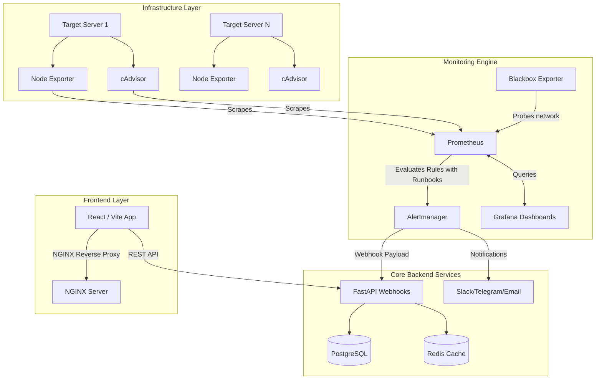
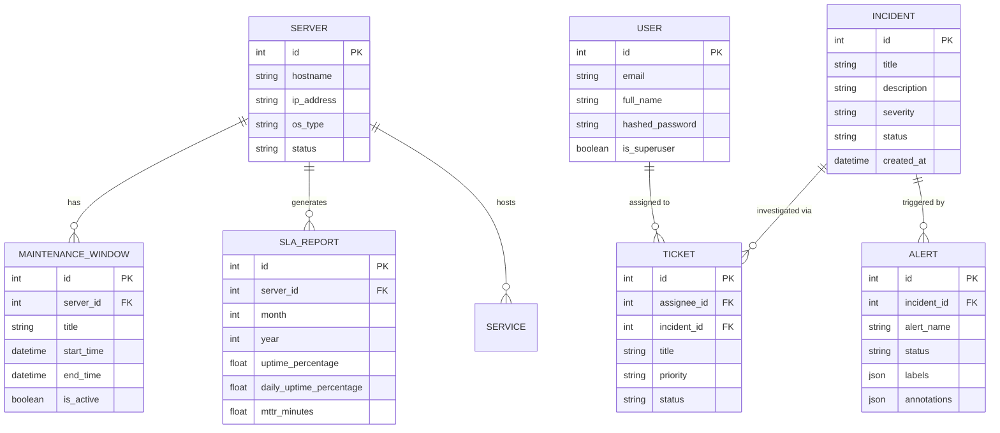

# Infrastructure Monitoring & Incident Management Platform (v2.0)

**Tagline**: Real-Time Infrastructure Observability, Alerting, Incident Response, and SLA Management Platform.

An enterprise-grade, cloud-native observability platform built to ingest, analyze, and visualize real-time infrastructure metrics. This system acts as a unified command center for Site Reliability Engineers (SREs) and Network Operations Center (NOC) teams, providing automated alert triaging, formal Incident Management, structured Support Ticketing, and Maintenance Window scheduling, rivaling industry standards like Datadog, Grafana Cloud, and PagerDuty.

---

## 🌟 What's New in v2.0 (NOC Enhancements)
- **Blackbox Network Probing**: Integrated Prometheus Blackbox Exporter for active HTTP, DNS, TCP, and ICMP (Ping) health checks.
- **Maintenance Windows**: Schedule downtime via the UI to safely suppress noisy alerts and pause SLA tracking.
- **Runbooks & Escalations**: Deeply annotated Prometheus alerts that pipe embedded SOPs and escalation matrices directly into Incident tickets.
- **SLA & Uptime Reporting**: Daily, Weekly, and Monthly MTTR/MTBF tracking visualized via Recharts.
- **Deep Linux Monitoring**: File descriptor exhaustion, Zombie process tracking, and Load Average heuristics.
- **Multi-Channel Notifications**: Alertmanager routing for Slack, Telegram, and SMTP email dispatch.

---

## 🏛️ High-Level Architecture

The platform utilizes a modern microservices architecture, relying on Docker and Kubernetes for container orchestration. It decouples metric ingestion (Prometheus) from metric visualization (Grafana/Recharts) and incident routing (Alertmanager to FastAPI).



### Component Breakdown
1. **Frontend (React, TypeScript, Vite, TailwindCSS, Recharts)**
   - **Dashboard**: High-level KPI visualization and line charts depicting resource usage.
   - **Server Management**: Real-time tabular tracking of host status and utilization.
   - **Incident & Ticket Response**: Dedicated interfaces for tracking auto-generated incidents and runbook instructions.
   - **Maintenance & Reports**: Schedule downtime and view SLA compliance.
   
2. **Backend (Python 3.12, FastAPI, SQLAlchemy, Pydantic)**
   - **REST API**: Robust API layer serving frontend requests.
   - **Webhook Engine**: Intercepts alerts, checks for active Maintenance Windows, and generates Incidents.
   - **Authentication**: JWT-based stateless authentication mechanism.
   
3. **Data Layer (PostgreSQL, Redis)**
   - **PostgreSQL**: Stores persistent relational data (Users, Servers, Services, Incidents, Alerts, Tickets, SLAs, Maintenance Windows).
   - **Redis**: Provides distributed caching and session management capabilities.
   
4. **Monitoring Stack (Prometheus, Grafana, Alertmanager, Node Exporter, cAdvisor, Blackbox)**
   - **Prometheus**: Time-series database actively scraping targets every 15s.
   - **Node Exporter**: Exposes deeply detailed hardware and OS-level metrics.
   - **cAdvisor**: Analyzes and exposes Docker container resource usage.
   - **Blackbox Exporter**: Probes endpoints over HTTP, DNS, TCP, and ICMP.
   - **Alertmanager**: Groups, deduplicates, and routes Prometheus rule violations.

---

## 🗄️ Database Entity Relationship (ER) Diagram



---

## 📂 Deep Directory Structure

```text
observability-platform/
├── backend/                        # FastAPI Application
│   ├── app/
│   │   ├── api/                    # API Routers (auth, servers, webhooks, tickets, maintenance)
│   │   ├── models/                 # SQLAlchemy DB Models
│   │   └── schemas/                # Pydantic validation schemas
│   ├── scripts/                    # Database seeding scripts (seed.py)
│   ├── tests/                      # Pytest unit and integration tests
│   └── Dockerfile                  # Production-ready Python image config
├── frontend/                       # React Web Application
│   ├── src/
│   │   ├── pages/                  # Views (Dashboard, Maintenance, Reports, etc.)
│   │   └── App.tsx                 # Core Routing configuration
│   └── Dockerfile                  # Multi-stage NGINX build
├── monitoring/                     # Infrastructure as Code
│   ├── alertmanager/
│   │   └── alertmanager.yml        # Slack/Email/Telegram routing configs
│   ├── blackbox/
│   │   └── blackbox.yml            # ICMP/HTTP probe settings
│   ├── grafana/
│   │   └── provisioning/           # Automated Datasource/Dashboard loading
│   └── prometheus/
│       ├── prometheus.yml          # Scrape targets and Auto-Discovery scaffolds
│       └── alert.rules.yml         # Mathematical threshold definitions and Runbooks
├── k8s/                            # Kubernetes Manifests
├── .github/workflows/              # CI/CD pipelines
└── docker-compose.yml              # Local orchestration stack
```

---

## 🚀 Deployment & Usage

### 1. Local Deployment (Docker Compose)
The simplest way to boot the entire stack (Frontend, Backend, DB, Monitoring) is via Docker Compose.

```bash
git clone https://github.com/your-username/observability-platform.git
cd observability-platform
docker-compose up --build -d
```

### 2. Seeding the Database
To populate the platform with realistic mock data (Servers, Incidents, Tickets, Admin user):
```bash
docker exec -it observability-backend python scripts/seed.py
```

### 3. Service Access Points

| Service | Address | Default Credentials | Description |
|---------|---------|---------------------|-------------|
| **Platform UI** | `http://localhost:80` | None | The primary React dashboard. |
| **Backend API** | `http://localhost:8000/docs` | None | Swagger UI for REST endpoints. |
| **Grafana** | `http://localhost:3000` | `admin` / `admin` | Deep visualization and analytics. |
| **Prometheus** | `http://localhost:9090` | None | Raw metric querying interface. |
| **cAdvisor** | `http://localhost:8080` | None | Container resource visualization. |
| **Blackbox** | `http://localhost:9115` | None | Network probe interface. |

### 4. Enterprise Deployment (Kubernetes)
For High Availability (HA) production environments, utilize the provided Kubernetes manifests. The images must be pushed to a container registry (e.g., Docker Hub, ECR) via the included GitHub Actions pipeline.

```bash
kubectl apply -f k8s/deployment.yaml
```

---

## 🧪 Testing

The backend is fully equipped with `pytest` for unit and integration testing. Tests simulate real API interactions utilizing FastAPI's `TestClient`.

```bash
docker exec -it observability-backend bash
pytest tests/
```
