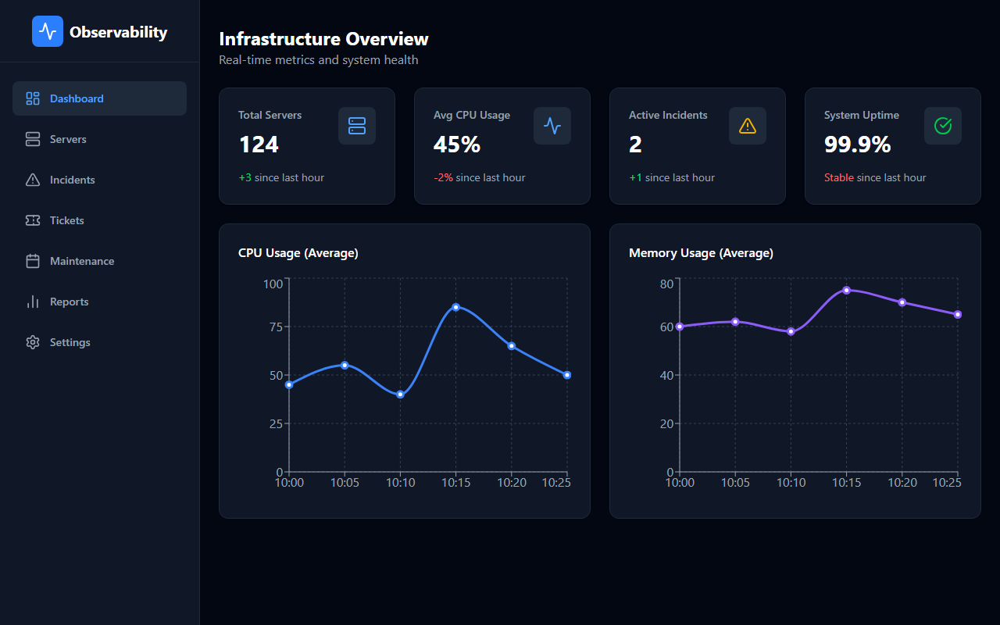
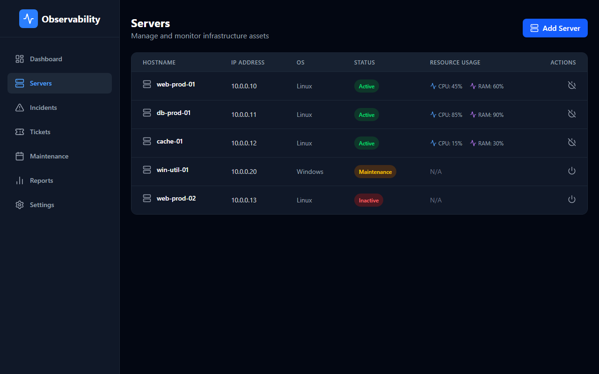
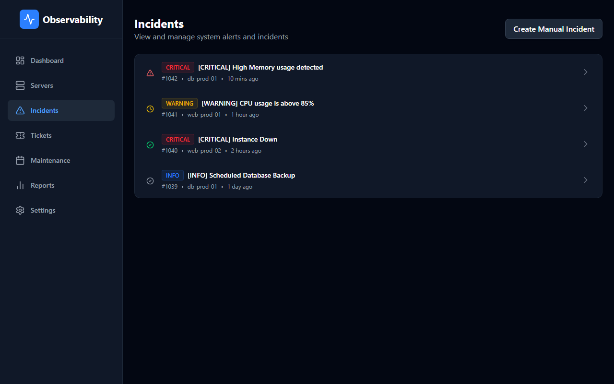
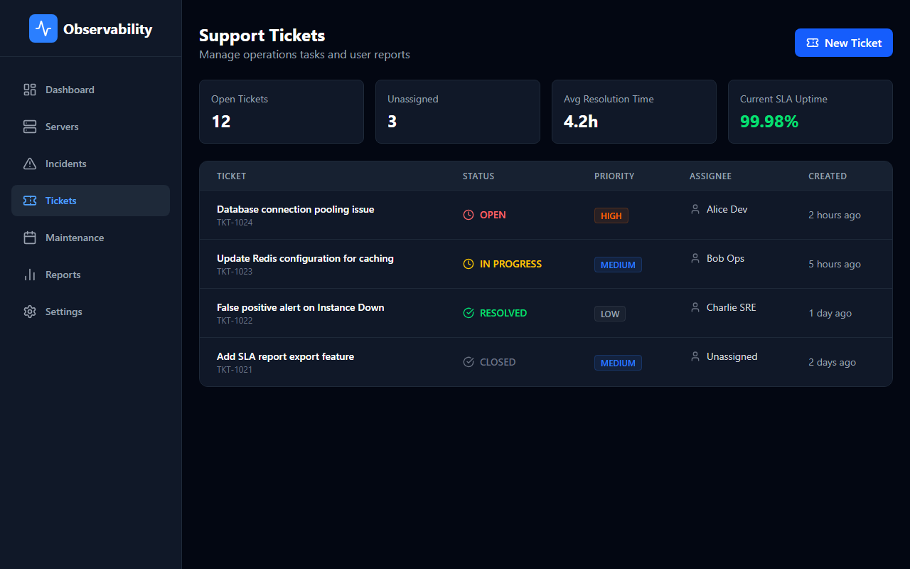

# Enterprise Identity & Cloud Observability Platform


A Fortune 500-grade, event-driven **Identity & Access Management (IAM)** and Cloud Infrastructure Observability platform. 

Designed specifically to demonstrate deep expertise in the domains of Modern Identity (JumpCloud, Okta), Cloud Engineering, Security Engineering, Distributed Systems, and DevOps.



<details>
<summary><b>View More Screenshots</b></summary>
<br>





</details>

## 🌟 Core Identity & Security Features

- **OAuth2 & OIDC**: Full authorization code flows, Access/Refresh tokens, and Token Revocation endpoints built in Go.
- **Device Management**: API endpoints for Device Registration, Trust Status, OS Health, and Policy Assignment.
- **Session Management**: Endpoints for Active Sessions, Terminate Session, and Concurrent Login Detection.
- **Event-Driven Microservices**: Powered by Apache Kafka (KRaft mode), ensuring highly scalable, asynchronous communication between nodes.
- **Dynamic Security**: AWS Secrets Manager integration for dynamic credential retrieval. AWS IAM Roles for Service Accounts (IRSA) via OIDC Federation.
- **Dual Frontends**: 
  - **Identity Portal (Vue 3)**: Administration for users, devices, policies, and audit logs.
  - **Operations Dashboard (React)**: SRE & NOC operations and metrics.

## 🤖 AI & Observability

- **AI-Assisted Operations (AIOps)**: A specialized Python microservice performing LLM-assisted Root Cause Analysis (RCA), Runbook Generation, and Natural Language Log Explanation.
- **The Three Pillars of Observability**: 
  - **Metrics**: Prometheus, Alertmanager & Grafana.
  - **Traces**: OpenTelemetry (OTel) distributed tracing via Jaeger.
  - **Logs**: Centralized, structured log aggregation via Grafana Loki & Promtail.

---

## 🏗️ Architecture Diagram

```mermaid
graph TD
    %% Frontends
    Client([Web / Mobile Client])
    NOC[React NOC Dashboard\n(Port 3000)]
    Admin[Vue 3 Identity Portal\n(Port 3001)]
    
    %% API Gateway
    Ingress{{API Gateway / NGINX}}
    
    %% Microservices
    API[Python Core API\nFastAPI / Port 8000]
    Identity[Go Identity Engine\ngRPC / Port 50051]
    AIOps[AI Ops API\nFastAPI / Port 8002]
    
    %% Event Streaming
    Kafka{Apache Kafka\n(KRaft Mode)}
    
    %% Databases & Secrets
    DB[(PostgreSQL)]
    Redis[(Redis Cache)]
    AWS[AWS Secrets Manager]
    
    %% Observability Stack
    Prometheus(Prometheus)
    Alertmanager(Alertmanager)
    Grafana(Grafana)
    Jaeger(Jaeger\nOTel Tracing)
    Loki(Grafana Loki\nLog Aggregation)
    
    %% Routing
    Client --> NOC
    Client --> Admin
    NOC --> Ingress
    Admin --> Ingress
    Ingress --> API
    Ingress --> Identity
    
    %% Microservice Comms
    API -- "gRPC Auth" --> Identity
    API -- "Fetch Creds" --> AWS
    API -- "Publish Events" --> Kafka
    Identity -- "Publish Audit Logs" --> Kafka
    Kafka -- "Consume Events" --> AIOps
    AIOps -- "Publish AI Insights" --> Kafka
    
    %% Data Persistence
    API --> DB
    API --> Redis
    Identity --> DB
    
    %% Telemetry
    API -. "OTLP Traces" .-> Jaeger
    Identity -. "OTLP Traces" .-> Jaeger
    API -. "/metrics" .-> Prometheus
    Prometheus --> Alertmanager
    Grafana -. "Queries Data" .-> Prometheus
    Grafana -. "Queries Logs" .-> Loki
    Grafana -. "Queries Traces" .-> Jaeger
```

---

## 📂 Repository Structure (Monorepo)

```text
observability-platform/
├── apps/
│   ├── dashboard-react/     # React NOC Operations Dashboard (Vite + Tailwind)
│   └── identity-vue/        # Vue 3 Identity Administration Portal (Vite + TS)
├── services/
│   ├── api-python/          # Core Infrastructure API (FastAPI, SQLAlchemy, Kafka, AWS Secrets)
│   ├── identity-go/         # Enterprise IAM Service (Golang, gRPC, OAuth2, Device Trust)
│   └── aiops-python/        # LLM Root Cause Analysis Service (FastAPI, Langchain, Kafka)
├── gateway/                 # API Gateway Configurations (NGINX/Envoy)
├── shared/                  
│   └── protobuf/            # Shared Protobufs (OAuth2, Sessions, Devices)
├── infra/
│   ├── helm/                # Kubernetes Helm Charts for dynamic deployment
│   └── monitoring/          # Grafana, Prometheus, Alertmanager, Loki configurations
├── tests/                   # Cypress E2E Automation tests
├── docker-compose.yml       # Local development stack (Kafka KRaft, Monitoring, DBs)
└── .github/workflows/       # CI/CD Pipelines (Testing, Docker Build, Helm Deploy)
```

---

## 🚀 Getting Started (Local Development)

### Prerequisites
- Docker Engine & Docker Compose V2
- Python 3.11+
- Go 1.23+
- Node.js 20+
- Minimum 8GB RAM available for Docker.

### 1. Spin up the Infrastructure
Bring up the entire microservice and observability stack via Docker Compose:

```bash
docker-compose up -d
```

**Services Exposed:**
- **NOC Dashboard**: `http://localhost:3000`
- **Identity Portal**: `http://localhost:3001`
- **Python Core API**: `http://localhost:8000`
- **AI Ops API**: `http://localhost:8002`
- **Grafana**: `http://localhost:3003` (Admin / Admin)
- **Jaeger UI**: `http://localhost:16686`
- **Prometheus**: `http://localhost:9090`

### 2. Microservice Development
To run a service locally outside of Docker (for debugging):

**Go Identity Service**:
```bash
cd services/identity-go
go run cmd/server/main.go
```

**Python Core API**:
```bash
cd services/api-python
pip install -r requirements.txt
uvicorn main:app --reload --port 8000
```
