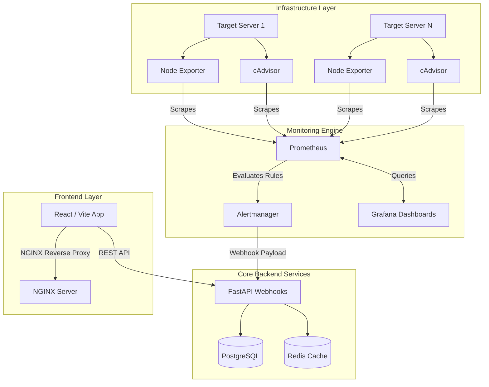
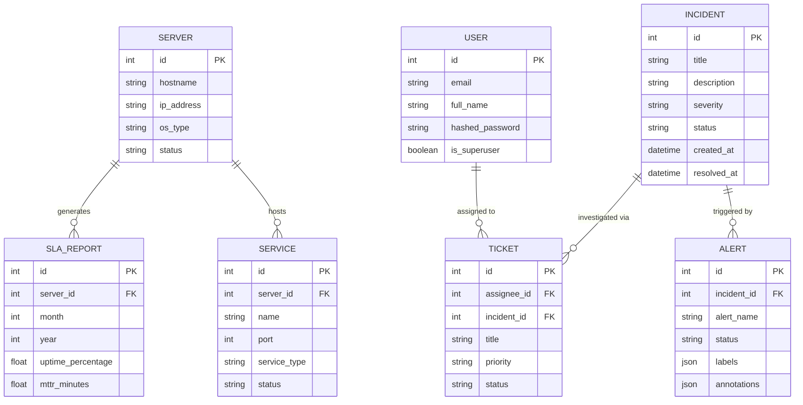

# Infrastructure Monitoring & Incident Management Platform

**Tagline**: Real-Time Infrastructure Observability, Alerting, Incident Response, and SLA Management Platform.

An enterprise-grade, cloud-native observability platform built to ingest, analyze, and visualize real-time infrastructure metrics. This system acts as a unified command center for Site Reliability Engineers (SREs) and Operations teams, providing automated alert triaging, formal Incident Management, and structured Support Ticketing, rivaling industry standards like Datadog, Grafana Cloud, and PagerDuty.

---

## 🏛️ High-Level Architecture

The platform utilizes a modern microservices architecture, relying on Docker and Kubernetes for container orchestration. It decouples metric ingestion (Prometheus) from metric visualization (Grafana/Recharts) and incident routing (Alertmanager to FastAPI).



### Component Breakdown
1. **Frontend (React, TypeScript, Vite, TailwindCSS, Recharts)**
   - **Dashboard**: High-level KPI visualization and line charts depicting resource usage.
   - **Server Management**: Real-time tabular tracking of host status and utilization.
   - **Incident Response**: Dedicated interface for tracking auto-generated incidents.
   - **Ticket Management**: Workflow interface for Operations staff to resolve assigned tasks.
   
2. **Backend (Python 3.12, FastAPI, SQLAlchemy, Pydantic)**
   - **REST API**: Robust API layer serving frontend requests.
   - **Webhook Engine**: Receives automated firing alerts from Alertmanager and dynamically auto-generates corresponding database Incidents.
   - **Authentication**: JWT-based stateless authentication mechanism.
   
3. **Data Layer (PostgreSQL, Redis)**
   - **PostgreSQL**: Stores persistent relational data (Users, Servers, Services, Incidents, Alerts, Tickets, SLAs).
   - **Redis**: Provides distributed caching and session management capabilities.
   
4. **Monitoring Stack (Prometheus, Grafana, Alertmanager, Node Exporter, cAdvisor)**
   - **Prometheus**: Time-series database actively scraping targets every 15s.
   - **Node Exporter**: Exposes deeply detailed hardware and OS-level metrics.
   - **cAdvisor**: Analyzes and exposes Docker container resource usage and performance.
   - **Alertmanager**: Groups, deduplicates, and routes Prometheus rule violations.

---

## 🗄️ Database Entity Relationship (ER) Diagram

The system employs a tightly-coupled relational model optimized for observability contexts.



---

## 📂 Deep Directory Structure

```text
observability-platform/
├── backend/                        # FastAPI Application
│   ├── alembic/                    # Database migration configuration
│   ├── app/
│   │   ├── api/                    # API Routers (auth, servers, webhooks, tickets)
│   │   ├── core/                   # Security (JWT, hashing), Settings, and Configs
│   │   ├── db/                     # SQLAlchemy Session and Engine declarations
│   │   ├── models/                 # SQLAlchemy DB Models (Server, Incident, Alert)
│   │   └── schemas/                # Pydantic validation schemas
│   ├── scripts/                    # Database seeding scripts (seed.py)
│   ├── tests/                      # Pytest unit and integration tests
│   ├── Dockerfile                  # Production-ready Python image config
│   └── requirements.txt            # Python dependencies
├── frontend/                       # React Web Application
│   ├── src/
│   │   ├── components/             # Reusable UI (Sidebar, Layout)
│   │   ├── pages/                  # Views (Dashboard, Servers, Incidents, Tickets)
│   │   ├── App.tsx                 # Core Routing configuration
│   │   └── main.tsx                # Application Entrypoint
│   ├── Dockerfile                  # Multi-stage NGINX build
│   └── nginx.conf                  # Reverse Proxy configuration
├── monitoring/                     # Infrastructure as Code
│   ├── alertmanager/
│   │   └── alertmanager.yml        # Webhook routing configurations
│   ├── grafana/
│   │   ├── dashboards/             # Pre-configured JSON dashboards (Node Exporter)
│   │   └── provisioning/           # Automated Datasource/Dashboard loading
│   └── prometheus/
│       ├── prometheus.yml          # Scrape target configurations
│       └── alert.rules.yml         # Mathematical metric threshold definitions
├── k8s/                            # Kubernetes Manifests
│   └── deployment.yaml             # Pod deployment and service definitions
├── .github/workflows/              # CI/CD pipelines
│   └── ci.yml                      # Automated testing and Docker Image builds
└── docker-compose.yml              # Local orchestration stack
```

---

## 🚀 Deployment & Usage

### 1. Local Deployment (Docker Compose)
The simplest way to boot the entire stack (Frontend, Backend, DB, Monitoring) is via Docker Compose.

```bash
# Clone the repository
git clone https://github.com/your-username/observability-platform.git
cd observability-platform

# Build and start all services in detached mode
docker-compose up --build -d
```

### 2. Seeding the Database
To populate the platform with realistic mock data (Servers, Incidents, Tickets, Admin user):
```bash
# Execute the seed script inside the backend container
docker exec -it observability-backend python scripts/seed.py
```

### 3. Service Access Points
Once the containers are successfully running, the services map to the following local ports:

| Service | Address | Default Credentials | Description |
|---------|---------|---------------------|-------------|
| **Platform UI** | `http://localhost:80` | None | The primary React dashboard. |
| **Backend API** | `http://localhost:8000/docs` | None | Swagger UI for REST endpoints. |
| **Grafana** | `http://localhost:3000` | `admin` / `admin` | Deep visualization and analytics. |
| **Prometheus** | `http://localhost:9090` | None | Raw metric querying interface. |
| **cAdvisor** | `http://localhost:8080` | None | Container resource visualization. |

### 4. Enterprise Deployment (Kubernetes)
For High Availability (HA) production environments, utilize the provided Kubernetes manifests. The images must be pushed to a container registry (e.g., Docker Hub, ECR) via the included GitHub Actions pipeline.

```bash
# Apply the core backend and frontend deployments and services
kubectl apply -f k8s/deployment.yaml
```

---

## 🧪 Testing

The backend is fully equipped with `pytest` for unit and integration testing. Tests simulate real API interactions utilizing FastAPI's `TestClient`.

```bash
# Enter the backend container
docker exec -it observability-backend bash

# Run the test suite
pytest tests/
```

---

## 🛡️ Future Enhancements
- **Multi-tenant Architecture**: Support multiple isolated organizations within a single deployment.
- **Log Aggregation**: Integrate Promtail and Loki alongside Prometheus to centralize system logs.
- **Machine Learning**: Implement predictive anomaly detection on CPU/Memory usage graphs to generate pre-emptive incidents before hard thresholds are breached.
